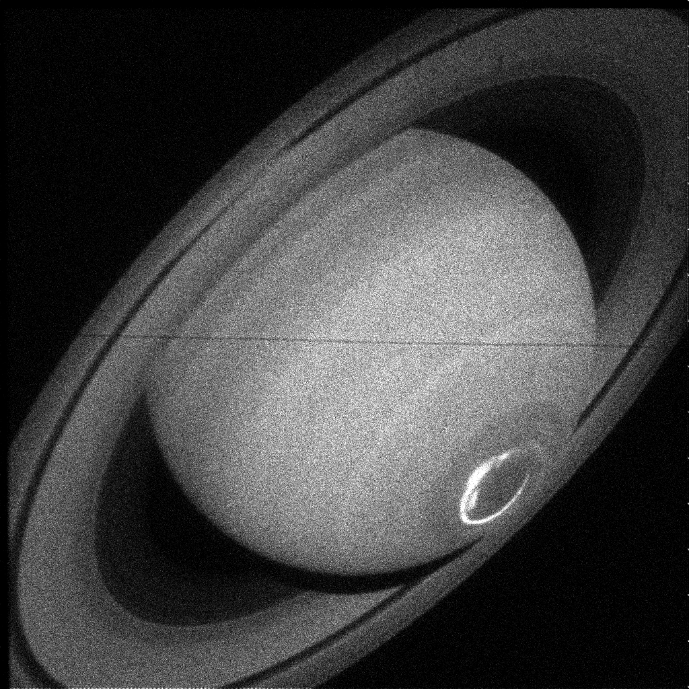

# Lightweight Liberator
I find myself processing a few FITS files and, while FITS Liberator is a great tool, I think it would be easier at times to just output the images as a simple greyscale png, so that I can get a "glance" at them. That's what this script does.
# Example:
Using a few Hubble images that I found on MAST https://mast.stsci.edu/portal/Mashup/Clients/Mast/Portal.html, I ran this script and got the following minimally-processed image of Saturn!

# Requirements:
1. Python
2. Numpy
3. Astropy
4. Imageio
# To use
Simply make a two folders titled "FITS" and "pngs", put the FITS files into the "FITS" folder, and run `python liberator.py`.
